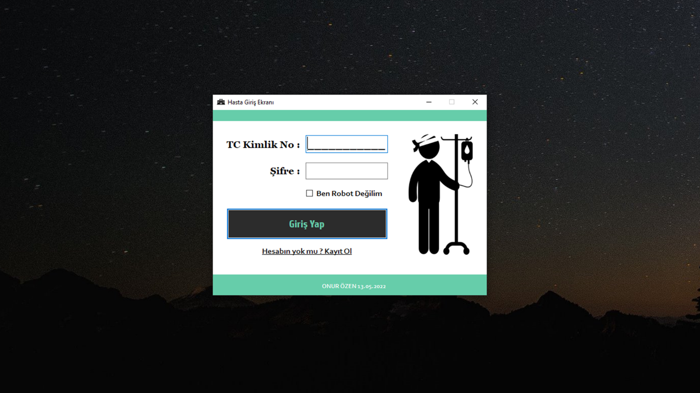
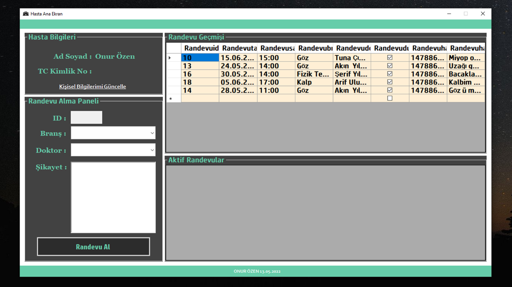
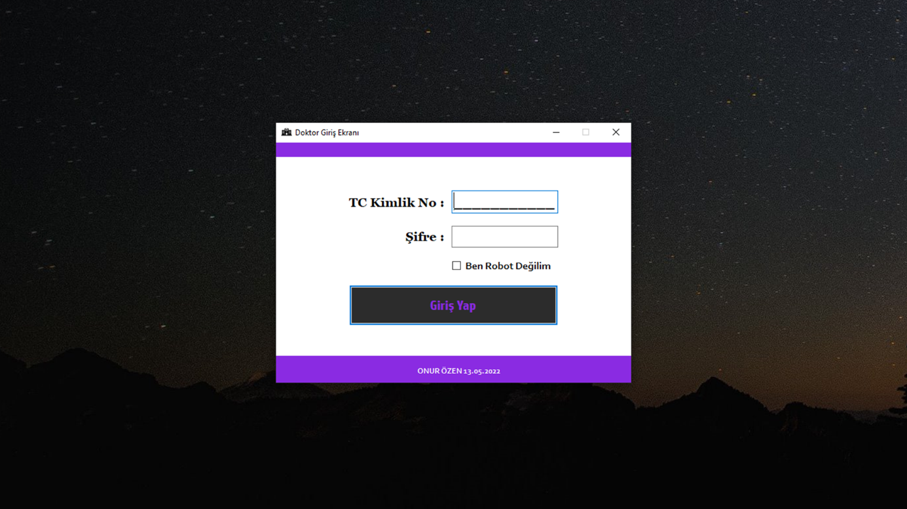
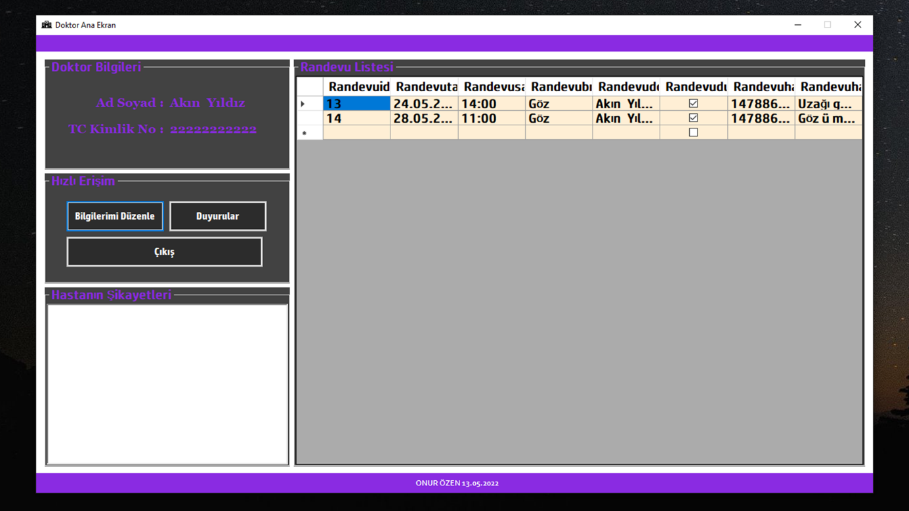
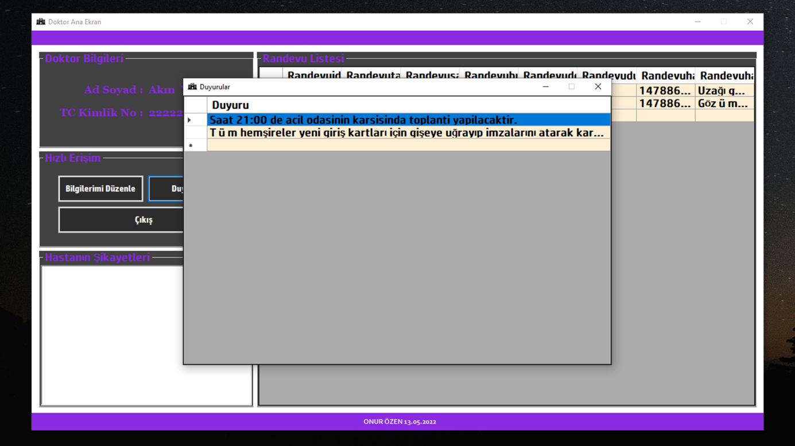
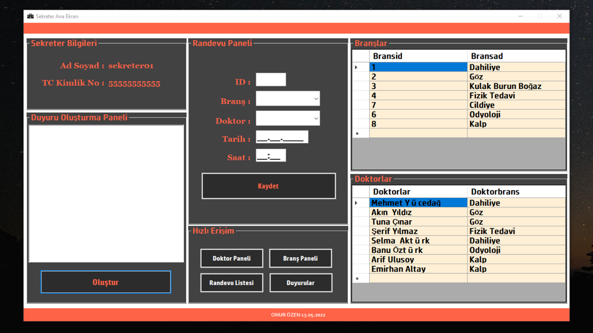
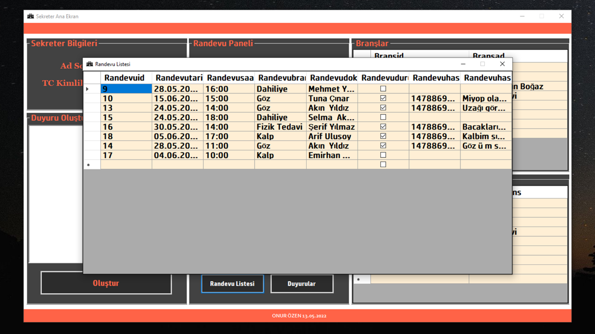

**Hastahane Randevu Sistemi**

C#

MSSQL

{width="6.3in"
height="3.5416666666666665in"}{width="6.3in"
height="3.5416666666666665in"}{width="6.3in"
height="3.5416666666666665in"}{width="6.3in"
height="3.5416666666666665in"}{width="6.3in"
height="3.5416666666666665in"}{width="6.3in"
height="3.5416666666666665in"}{width="6.3in"
height="3.5416666666666665in"}{width="6.3in"
height="3.5416666666666665in"}
